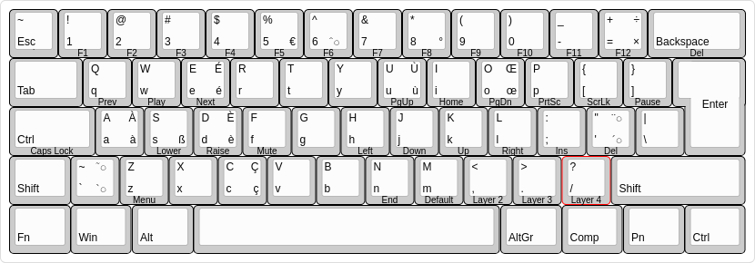

# POK3R keyboard layout for X

Final layout:

From [www.keyboard-layout-editor.com](www.keyboard-layout-editor)

## Hardware keyboard programming
* `Fn + .` to switch to Layer 3 (red LED)
* `Fn + R_Ctrl` to enter programming mode (spacebar right LED steadily lit)
* Set VIM like HJKL and Home
  * Left: `Fn + H` (LED flashing) then `Fn + J` then `Pn` (LED steadily lit again)
  * Down: `Fn + J` then `Fn + K` then `Pn` 
  * Up: `Fn + K` then `Fn + I` then `Pn` 
  * Home: `Fn + I` then `Fn + H` then `Pn`
* Set CapsLock as Ctrl
  * `CapsLock` then `L_Ctrl` then `Pn`
* `Fn + R_Ctrl` to exit programming mode (LED off)
* Set L_Ctrl as Fn
  * Unplug keyboard
  * Turn on DIP switch 4
  * Plug keyboard
  * `Fn` then `L_Ctrl` then `Pn` then `Pn`
  * Turn off DIP switch 4
